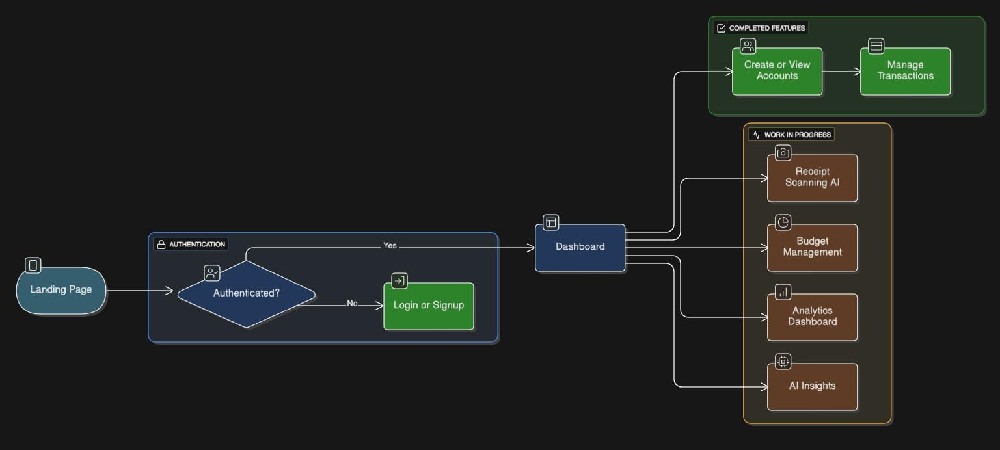
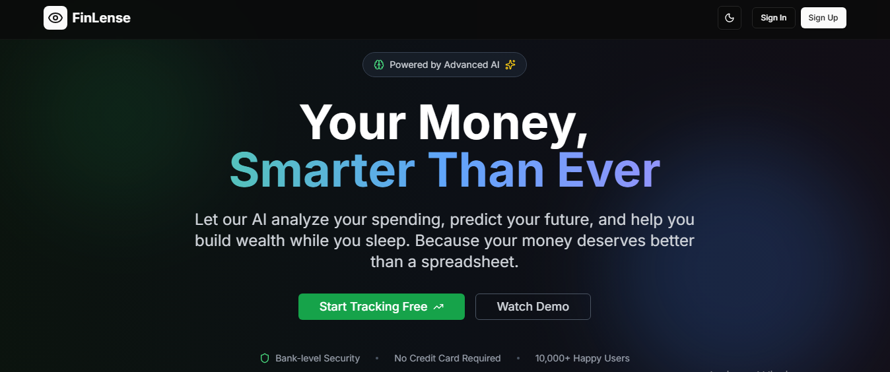

# Finlense

## 1. Project Overview

FinLense is an AI-driven personal finance platform that automates expense tracking using receipt scanning, intelligent categorization, and predictive analytics.
The goal is to reduce manual bookkeeping effort and provide users with real-time financial insights, helping them make smarter financial decisions.

## 2. Problem Statement

Managing personal finances is time-consuming, error-prone, and fragmented across multiple apps and receipts.
Most existing tools either lack automation or fail at providing predictive insights.
FinLense solves this by leveraging AI to automate data entry, categorize expenses, and deliver real-time dashboards for financial awareness.

## 3. Features

**Authentication**: Secure login/signup using Clerk Authentication.

- **Account Management**: Create, view, and manage financial accounts.
- **Transaction Management**: Add, view, and filter transactions.
- **Receipt Scanning AI**: Upload receipts for automatic OCR-based data extraction (GPT-4 Vision planned).
- **Budget Management**: Set budgets, track expenses, and receive alerts.
- **Analytics Dashboard**: Insights into spending patterns, financial goals, and trends.
- **AI Insights**: Predictive recommendations for smarter financial planning.

## 4. Tech Stack

**Frontend**: Next.js, React, TailwindCSS, Shadcn UI

- **Backend**: Next.js API Routes, Prisma ORM
- **Database**: PostgreSQL (Supabase)
- **AI/ML**: OpenAI GPT-4 Vision (receipt scanning)
- **Authentication**: Clerk
- **Integrations**: Resend (emails), Inngest (background jobs), Arcjet (security)

## 5. User Flow



## 6. Landing Page



## 7. Installation

```bash
1. Clone repository
https://github.com/vivekprajapati-exe/finlense
git pull origin main
```

```bash
2. Install dependencies
npm install
```

```bash
3. Setup environment variables
cp .env.example .env
```

```bash
4. Run development server
npm run dev
```

## 8. Documentation

```bash
FINLENSE/
│── actions/              # Business logic (account.js, dashboard.js, seed.js)
│── app/                  # Next.js App Router
│── components/           # UI components (Shadcn + custom)
│── data/                 # Static/dynamic seed data
│── hooks/                # React hooks for state/data management
│── lib/                  # Utility functions
│── node_modules/         # Dependencies
│── prisma/               # Database schema + migrations
│── public/               # Static assets (images, icons, etc.)
│── .clerk/               # Clerk authentication configs
│── .gitignore            # Git ignore rules
│── components.json       # Shadcn UI config
│── eslint.config.mjs     # ESLint rules
│── jsconfig.json         # Path aliases & JS config
│── middleware.js         # API middleware
│── next.config.mjs       # Next.js project config
│── package.json          # Project dependencies
│── package-lock.json     # Dependency lock file
│── postcss.config.mjs    # PostCSS config
│── PRD.md                # Product Requirements Document
│── README.md             # Project documentation
│── tailwind.config.mjs   # Tailwind CSS config
```

## 9. Usage

1. Sign up or log in using Clerk authentication.
2. Create or link accounts.
3. Upload a receipt to test AI-powered scanning (when available).
4. View transactions in the dashboard.
5. Track budgets and analyze spending trends.

## 10. Future Scope

- **Short-Term**: Multilingual receipts, email invoice parsing
- **Mid-Term**: Tax-ready reports, budgeting alerts, analytics enhancements
- **Long-Term**: AI financial advisor, multi-currency support, shared budgets, bank API integrations
